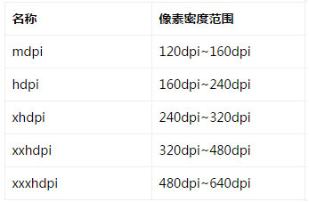

几个重要概念：

屏幕相关

屏幕尺寸：屏幕对角线的长度，单位为英寸，1 inch = 2.54 cm
屏幕分辨率：屏幕横向和纵向上像素点的个数，单位为px
屏幕像素密度：指的是每英寸上像素点的个数，单位为dpi （dot per inch）

相关单位：

pxs
dip（density independent pixels）和dp是一个意思，表示密度无关像素。
sp和dip类似，但一般用于设置字体的大小

在设计图标时，对于五种主流的像素密度（MDPI、HDPI、XHDPI、XXHDPI 和 XXXHDPI）应按照 2:3:4:6:8 的比例进行缩放。

下图为图标的各个屏幕密度的对应尺寸：

